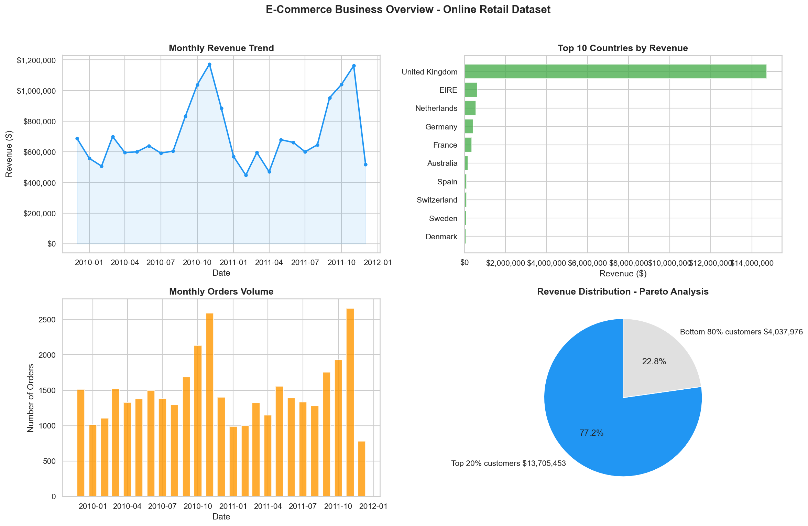
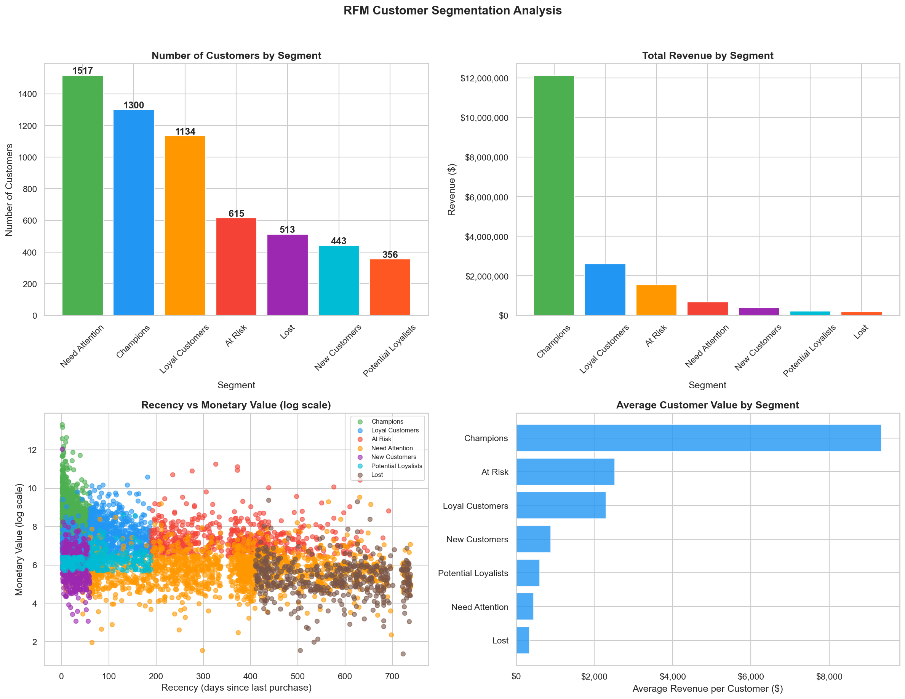
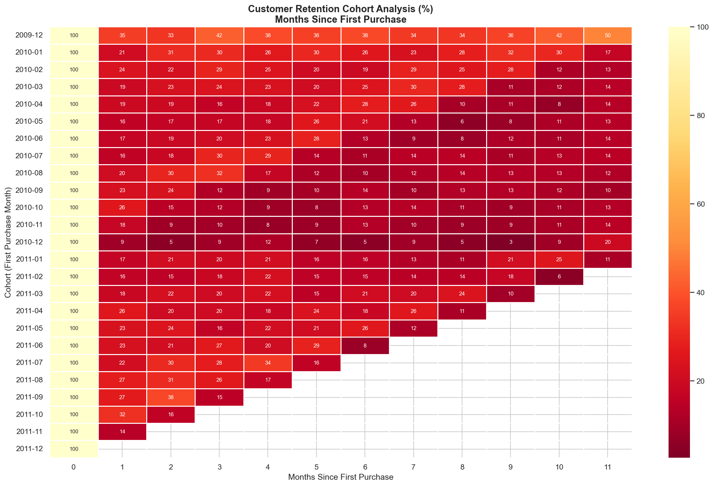
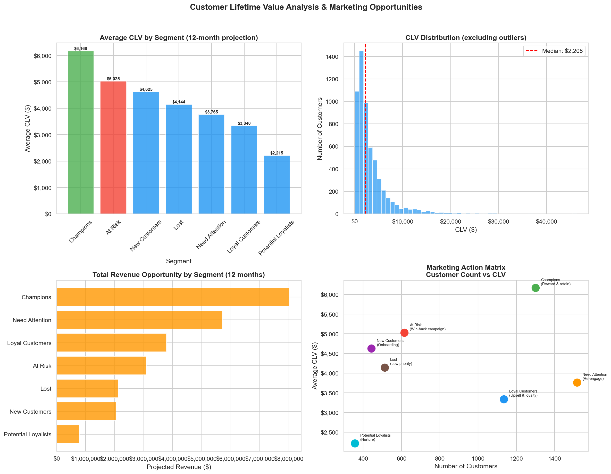
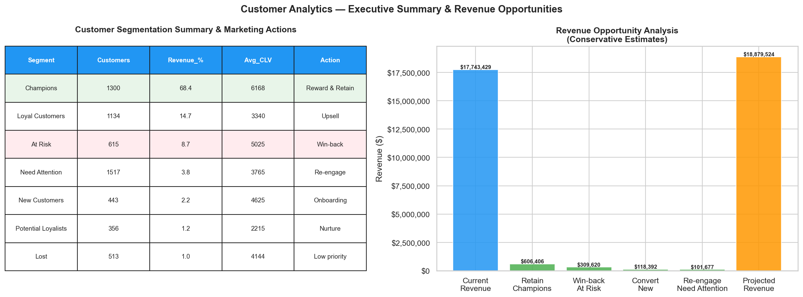

# 📊 Customer Analytics — RFM Segmentation, CLV & Marketing Performance

> **End-to-end customer analytics pipeline that transforms 800K+ retail transactions into actionable marketing strategy — identifying who your best customers are, how much they're worth, and exactly what to do with each segment.**

[](https://python.org)
[](https://mysql.com)
[](https://powerbi.microsoft.com)
[](https://scikit-learn.org)
[]()

---

## 🧠 The Business Problem

A UK-based e-commerce retailer processes thousands of transactions per month across multiple countries — but treats every customer the same. Marketing budget is distributed equally, campaigns are untargeted, and there is no visibility into which customers are driving revenue, which are at risk of churning, and which will never return.

Without customer intelligence:
- **Marketing spend is wasted** — same message to Champions and Lost customers alike
- **High-value customers go unrecognized** — no loyalty or retention strategy
- **At-risk customers churn silently** — no early warning system
- **Revenue opportunity is invisible** — no CLV projection to guide investment decisions

**This project builds that intelligence from scratch.**

---

## ✅ The Solution

A full customer analytics pipeline that segments 5,878 customers using RFM methodology, calculates 12-month Customer Lifetime Value projections, analyzes retention cohorts, and delivers an executive Power BI dashboard with concrete marketing recommendations per segment.

> *From 800K raw transactions to a complete marketing strategy — with $1.1M in identified revenue opportunities.*

---

## 📐 Architecture Overview

```
┌─────────────────────┐    ┌──────────────────────┐    ┌─────────────────────┐
│  Online Retail II   │───▶│   Python Analytics   │───▶│     MySQL DB        │
│  (Kaggle Dataset)   │    │  Notebook + Scripts  │    │  3 structured tables│
│  800K+ transactions │    │  RFM · CLV · Cohort  │    │  transactions       │
└─────────────────────┘    └──────────────────────┘    │  rfm_segments       │
                                                        │  clv_customers      │
                                                        └──────────┬──────────┘
                                                                   │
                                                    ┌──────────────▼──────────────┐
                                                    │      Power BI Dashboard      │
                                                    │  Executive Overview          │
                                                    │  Customer Segmentation       │
                                                    └─────────────────────────────┘
```

---

## 🔄 Pipeline — Step by Step

| Step | Action | Technology | Business Value |
|------|--------|------------|----------------|
| 1 | Load and clean 800K+ transactions | Python · pandas | Reliable, analysis-ready dataset |
| 2 | RFM scoring and customer segmentation | Python · pandas | 7 actionable customer segments |
| 3 | Cohort retention analysis | Python · pandas | Month-by-month retention visibility |
| 4 | Customer Lifetime Value projection (12M) | Python · pandas | Revenue forecasting per segment |
| 5 | Load structured tables to relational DB | MySQL · SQLAlchemy | Scalable, query-ready data model |
| 6 | Executive dashboard with marketing actions | Power BI · DAX | Decision-ready insights for stakeholders |

---

## 📊 Key Results

| Metric | Value |
|--------|-------|
| Total historical revenue | $17.74M |
| Customers analyzed | 5,878 |
| Champions (top segment) | 1,300 customers — **68% of total revenue** |
| At Risk customers | 615 — avg CLV $5,025 — win-back opportunity: **$309K** |
| Avg CLV projection (12M) | $4,350 per customer |
| Projected revenue (12M) | $25.57M |
| Month-1 retention rate | 21.2% |

---

## 👥 RFM Segmentation

Customers are scored across three dimensions — **Recency**, **Frequency**, and **Monetary value** — and classified into 7 strategic segments:

| Segment | Customers | Revenue % | Avg CLV | Recommended Action |
|---------|-----------|-----------|---------|-------------------|
| Champions | 1,300 | 68.4% | $6,168 | Reward & retain |
| Loyal Customers | 1,134 | 14.7% | $3,340 | Upsell |
| At Risk | 615 | 8.7% | $5,025 | Win-back campaign |
| Need Attention | 1,517 | 3.8% | $3,765 | Re-engage |
| New Customers | 443 | 2.2% | $4,625 | Onboarding |
| Potential Loyalists | 356 | 1.2% | $2,215 | Nurture |
| Lost | 513 | 1.0% | $4,144 | Low priority |

> **Key insight:** The top 22% of customers (Champions) generate 68% of total revenue — a textbook Pareto distribution that demands a differentiated marketing approach.

---

## 🔍 Analysis Deep Dive

**Business Overview — Revenue, Orders & Geographic Distribution**

Monthly revenue trend across 2 years, top 10 countries by revenue, order volume evolution, and Pareto distribution showing the top 20% of customers generating 77% of revenue.

**RFM Customer Segmentation**

7 behavioral segments built from Recency, Frequency and Monetary scoring. Champions (1,300 customers) account for 68.4% of total revenue while representing only 22% of the customer base.

**Customer Retention — Cohort Analysis**

Month-by-month retention heatmap from Dec 2009 to Dec 2011. Average Month-1 retention: 21.2%, stabilizing around 15–18% by Month 6 — revealing a critical retention window in the first 90 days.

**Customer Lifetime Value Analysis**

12-month CLV projection per segment, CLV distribution across the customer base (median $2,208), total revenue opportunity by segment, and the Marketing Action Matrix mapping CLV vs customer count.

**Executive Summary & Revenue Opportunities**

Consolidated view: segmentation summary with recommended actions per segment, and conservative revenue opportunity analysis showing $1.13M in identifiable upside from targeted campaigns.

---

## 📊 Dashboard

Two-page Power BI dashboard designed for different stakeholder audiences:

**Page 1 — Executive Overview** *(C-Level audience)*


- KPI cards: Total Revenue · Customers · Orders · AOV · Avg CLV
- Monthly Revenue Trend (2009–2011)
- Revenue by Country — Top 5
- Revenue Distribution by Segment (donut)
- Monthly Orders Volume

**Page 2 — Customer Segmentation** *(Marketing team audience)*


- Champions Revenue % · At Risk Count · Avg CLV · Retention Rate M1
- Customers by Segment
- Revenue by Segment
- Avg CLV by Segment (12M Projection)
- **Marketing Action Matrix** — scatter plot: customer count vs CLV, bubble size = revenue

---

## 💡 Revenue Opportunity Analysis

| Opportunity | Segment | Conservative Estimate |
|-------------|---------|----------------------|
| Retain Champions (5% uplift) | Champions | $606K |
| Win-back At Risk customers | At Risk | $309K |
| Convert New to Loyal | New Customers | $118K |
| Re-engage Need Attention | Need Attention | $102K |
| **Total identified opportunity** | | **$1.13M** |

---

## 🛠️ Tech Stack

| Layer | Technology | Purpose |
|-------|------------|---------|
| Analysis | Python · pandas · numpy | Data cleaning, RFM scoring, CLV calculation |
| Visualization | matplotlib · seaborn | Exploratory analysis charts |
| Database | MySQL 8.0 · SQLAlchemy | Structured storage with indexed tables |
| ETL Scripts | Python · pymysql | Automated data loading pipeline |
| Dashboard | Power BI · DAX | Executive and operational reporting |

---

## 📁 Repository Structure

```
customer-analytics/
│
├── notebooks/
│   └── 01_customer_analytics.ipynb   # Full analysis: RFM, CLV, Cohort
├── scripts/
│   ├── load_to_mysql.py              # ETL: raw transactions → MySQL
│   └── load_rfm_clv.py              # ETL: analytical tables → MySQL
├── dashboard/
│   └── customer_analytics.pbix       # Power BI dashboard
├── data/
│   └── online_retail_II.csv          # Source dataset (not tracked in git)
├── img/                              # Dashboard screenshots
├── .env.example                      # Environment variables template
├── .gitignore
├── requirements.txt
└── README_ES.md                      # Spanish version
```

---

## 👤 Author

**Andrés Navarro**
Data Analyst · BI · Marketing Analytics · Python · SQL

[](https://github.com/AndyNavarro77)
[](https://www.linkedin.com/in/andr%C3%A9s-navarro77/)
[](https://andres-navarro-portfolio.netlify.app/)

---

*Built to demonstrate end-to-end marketing analytics capabilities — RFM segmentation, CLV modeling, cohort analysis, and executive dashboard design — skills directly applicable to e-commerce, fintech, and any data-driven marketing environment.*