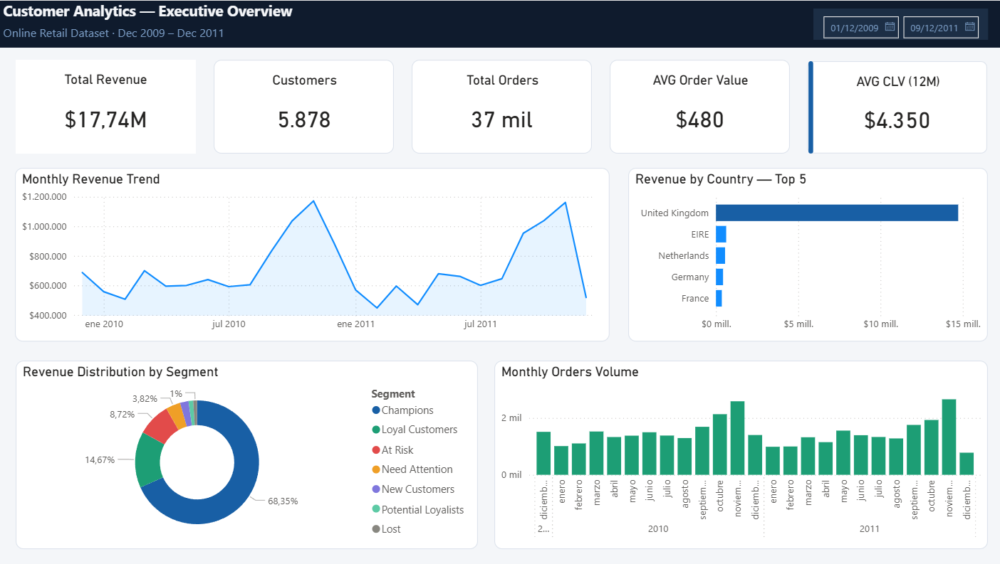
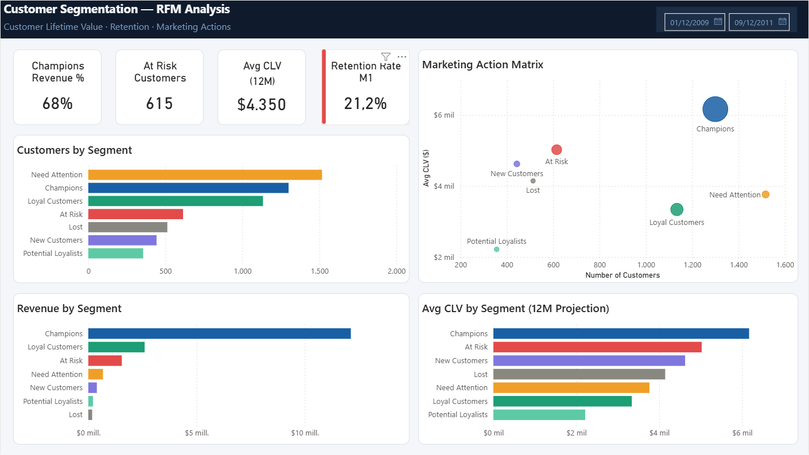

# 📊 Customer Analytics — Segmentación RFM, CLV & Performance de Marketing

> **Pipeline de análisis de clientes end-to-end que transforma 800K+ transacciones de retail en estrategia de marketing accionable — identificando quiénes son tus mejores clientes, cuánto valen, y exactamente qué hacer con cada segmento.**

[](https://python.org)
[](https://mysql.com)
[](https://powerbi.microsoft.com)
[](https://scikit-learn.org)
[]()

---

## 🧠 El Problema de Negocio

Un retailer de e-commerce del Reino Unido procesa miles de transacciones por mes en múltiples países — pero trata a todos sus clientes de la misma manera. El presupuesto de marketing se distribuye por igual, las campañas no tienen segmentación, y no existe visibilidad sobre qué clientes generan el revenue, cuáles están a punto de irse y cuáles no van a volver.

Sin inteligencia de clientes:
- **El presupuesto de marketing se desperdicia** — mismo mensaje para Champions y clientes perdidos
- **Los clientes de alto valor no son reconocidos** — sin estrategia de fidelización ni retención
- **Los clientes en riesgo se pierden en silencio** — sin sistema de alerta temprana
- **La oportunidad de revenue es invisible** — sin proyección de CLV para guiar decisiones de inversión

**Este proyecto construye esa inteligencia desde cero.**

---

## ✅ La Solución

Un pipeline completo de análisis de clientes que segmenta 5.878 clientes usando metodología RFM, calcula proyecciones de Customer Lifetime Value a 12 meses, analiza cohortes de retención, y entrega un dashboard ejecutivo en Power BI con recomendaciones de marketing concretas por segmento.

> *De 800K transacciones brutas a una estrategia de marketing completa — con $1.1M en oportunidades de revenue identificadas.*

---

## 📐 Arquitectura

```
┌─────────────────────┐    ┌──────────────────────┐    ┌─────────────────────┐
│  Online Retail II   │───▶│   Python Analytics   │───▶│     MySQL DB        │
│  (Dataset Kaggle)   │    │  Notebook + Scripts  │    │  3 tablas           │
│  800K+ transacc.    │    │  RFM · CLV · Cohorte │    │  transactions       │
└─────────────────────┘    └──────────────────────┘    │  rfm_segments       │
                                                        │  clv_customers      │
                                                        └──────────┬──────────┘
                                                                   │
                                                    ┌──────────────▼──────────────┐
                                                    │      Dashboard Power BI      │
                                                    │  Executive Overview          │
                                                    │  Customer Segmentation       │
                                                    └─────────────────────────────┘
```

---

## 🔄 Pipeline — Paso a Paso

| Paso | Acción | Tecnología | Valor de Negocio |
|------|--------|------------|------------------|
| 1 | Carga y limpieza de 800K+ transacciones | Python · pandas | Dataset confiable y listo para análisis |
| 2 | Scoring RFM y segmentación de clientes | Python · pandas | 7 segmentos de clientes accionables |
| 3 | Análisis de cohortes de retención | Python · pandas | Visibilidad de retención mes a mes |
| 4 | Proyección de Customer Lifetime Value (12M) | Python · pandas | Forecasting de revenue por segmento |
| 5 | Carga de tablas estructuradas a la base de datos | MySQL · SQLAlchemy | Modelo de datos escalable y consultable |
| 6 | Dashboard ejecutivo con acciones de marketing | Power BI · DAX | Insights listos para decisiones ejecutivas |

---

## 📊 Resultados Clave

| Métrica | Valor |
|---------|-------|
| Revenue histórico total | $17,74M |
| Clientes analizados | 5.878 |
| Champions (segmento top) | 1.300 clientes — **68% del revenue total** |
| Clientes en riesgo (At Risk) | 615 — CLV promedio $5.025 — oportunidad win-back: **$309K** |
| CLV promedio proyectado (12M) | $4.350 por cliente |
| Revenue proyectado (12M) | $25,57M |
| Tasa de retención mes 1 | 21,2% |

---

## 👥 Segmentación RFM

Los clientes son puntuados en tres dimensiones — **Recencia**, **Frecuencia** y **Valor Monetario** — y clasificados en 7 segmentos estratégicos:

| Segmento | Clientes | Revenue % | CLV Promedio | Acción Recomendada |
|----------|----------|-----------|--------------|-------------------|
| Champions | 1.300 | 68,4% | $6.168 | Recompensar y retener |
| Loyal Customers | 1.134 | 14,7% | $3.340 | Upsell |
| At Risk | 615 | 8,7% | $5.025 | Campaña win-back |
| Need Attention | 1.517 | 3,8% | $3.765 | Re-engagement |
| New Customers | 443 | 2,2% | $4.625 | Onboarding |
| Potential Loyalists | 356 | 1,2% | $2.215 | Nurturing |
| Lost | 513 | 1,0% | $4.144 | Baja prioridad |

> **Insight clave:** El 22% superior de clientes (Champions) genera el 68% del revenue total — una distribución Pareto clásica que exige una estrategia de marketing diferenciada.

---

## 📊 Dashboard

Dashboard de Power BI de dos páginas diseñado para distintas audiencias:

**Página 1 — Executive Overview** *(Audiencia C-Level)*



- Cards KPI: Revenue Total · Clientes · Órdenes · AOV · CLV Promedio
- Tendencia de Revenue Mensual (2009–2011)
- Revenue por País — Top 5
- Distribución de Revenue por Segmento (anillo)
- Volumen de Órdenes Mensual

**Página 2 — Customer Segmentation** *(Equipo de Marketing)*



- Champions Revenue % · At Risk Count · Avg CLV · Retention Rate M1
- Clientes por Segmento
- Revenue por Segmento
- CLV Promedio por Segmento (Proyección 12M)
- **Marketing Action Matrix** — scatter plot: cantidad de clientes vs CLV, tamaño de burbuja = revenue

---

## 💡 Análisis de Oportunidad de Revenue

| Oportunidad | Segmento | Estimación Conservadora |
|-------------|---------|------------------------|
| Retener Champions (5% uplift) | Champions | $606K |
| Recuperar clientes At Risk | At Risk | $309K |
| Convertir New en Loyal | New Customers | $118K |
| Re-enganchar Need Attention | Need Attention | $102K |
| **Oportunidad total identificada** | | **$1,13M** |

---

## 🛠️ Stack Tecnológico

| Capa | Tecnología | Propósito |
|------|------------|-----------|
| Análisis | Python · pandas · numpy | Limpieza, scoring RFM, cálculo de CLV |
| Visualización exploratoria | matplotlib · seaborn | Gráficos de análisis |
| Base de datos | MySQL 8.0 · SQLAlchemy | Almacenamiento estructurado con tablas indexadas |
| Scripts ETL | Python · pymysql | Pipeline de carga automatizado |
| Dashboard | Power BI · DAX | Reporting ejecutivo y operacional |

---

## 📁 Estructura del Repositorio

```
customer-analytics/
│
├── notebooks/
│   └── 01_customer_analytics.ipynb   # Análisis completo: RFM, CLV, Cohorte
├── scripts/
│   ├── load_to_mysql.py              # ETL: transacciones brutas → MySQL
│   └── load_rfm_clv.py              # ETL: tablas analíticas → MySQL
├── dashboard/
│   └── customer_analytics.pbix       # Dashboard Power BI
├── data/
│   └── online_retail_II.csv          # Dataset fuente (no incluido en git)
├── img/                              # Capturas del dashboard
├── .env.example                      # Plantilla de variables de entorno
├── .gitignore
├── requirements.txt
└── README.md                         # Versión en inglés
```

---

## 👤 Autor

**Andrés Navarro**
Analista de Datos · BI · Marketing Analytics · Python · SQL

[](https://github.com/AndyNavarro77)
[](https://www.linkedin.com/in/andr%C3%A9s-navarro77/)
[](https://andres-navarro-portfolio.netlify.app/)

---

*Desarrollado para demostrar capacidades de marketing analytics end-to-end — segmentación RFM, modelado de CLV, análisis de cohortes y diseño de dashboards ejecutivos — habilidades directamente aplicables a e-commerce, fintech y cualquier entorno de marketing orientado a datos.*